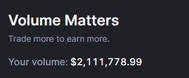

##  BackpackExchangeAutoTrade

bp交易所自动化刷空投工具,只需要充值solana到你的bp账号即可开始刷成交量
<br/>
如果你对你有帮助,可以使用我的邀请链接支持一下作者
<br/>
https://backpack.exchange/refer/10a88acf-22f4-43b5-aea0-dbfc3c7c69fb
<br/>
已经经过稳定性测试,刷了不少成交量
<br/>


##  如何创建BackpackExchange账号API

访问链接https://backpack.exchange/settings/api-keys
<br/>
点击按钮`New API Key`即可创建,记得保存APIKey和Secert,稍后放入代码中替换

##  替换API Key和Secert

找到`main.py`文件的代码

```

    API_KEY = ''
    API_SECERT = ''

```

在这里替换成账号生成的API Key/Secret即可

```

    API_KEY = 'gHAU.....'
    API_SECERT = 'U10N....'

```

##  怎么运行

脚本需要Python运行环境,使用官方下载链接 https://www.python.org/ftp/python/3.8.10/python-3.8.10-amd64.exe

####  更新依赖库

安装脚本依赖库

```

    pip install ed25519 requests

```

####  启动命令

```

    python ./main.py

```

####  脚本什么时候会停止运行

当你的Backpack账户的总资产少于0.1sol的时候就会自动退出执行,无需持续关注脚本执行
